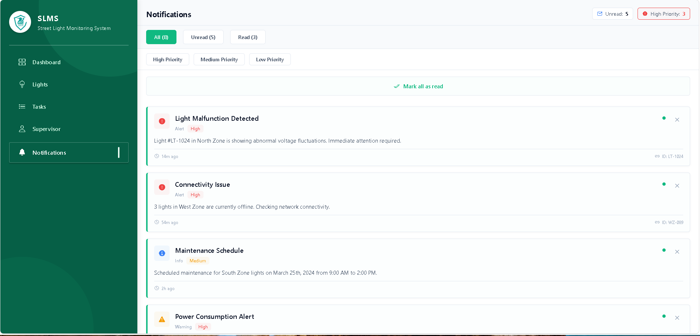
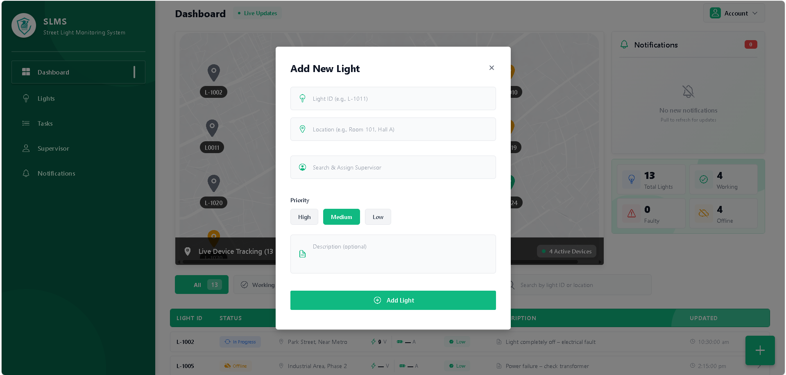
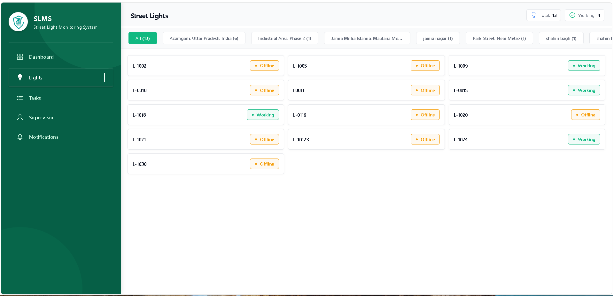
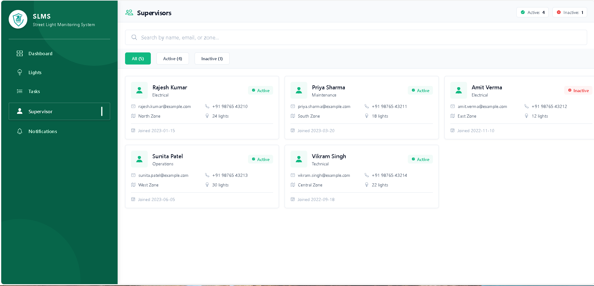
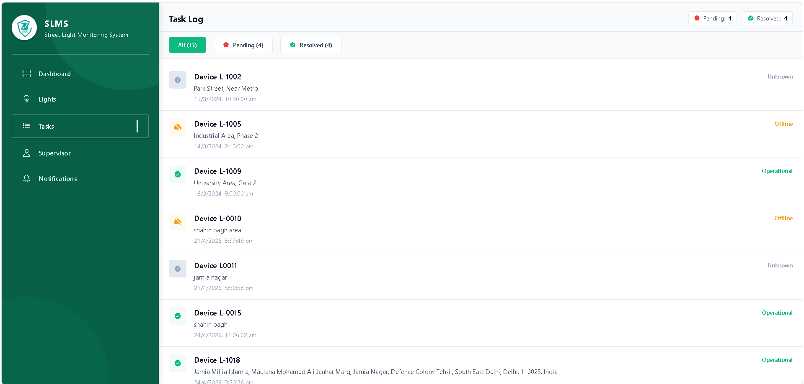

# Smart Street Light Monitoring System (SLMS)

An IoT-based real-time street light monitoring and maintenance platform designed for smart city infrastructure.

The system continuously monitors street lights using ESP8266-based IoT hardware and provides live fault detection, technician task management, supervisor assignment, and real-time device tracking through a modern web dashboard and mobile application.

---

# System Overview

Traditional street light maintenance systems are reactive and heavily manual.

SLMS automates the complete maintenance workflow:

- Street lights continuously send live device status data
- Faults are detected automatically
- Notifications are generated in real time
- Supervisors can assign repair tasks
- Technicians receive assigned tasks instantly
- Task completion updates device repair logs automatically

---

# Key Features

## Real-Time Device Monitoring

Each street light continuously sends live telemetry data to the backend every second.

Device statuses include:

- Working
- Faulty
- Offline
- In Progress

---

## Live Map-Based Device Tracking

Monitor all street lights directly on an interactive map interface.

Features:

- Live device visualization
- Device location tracking
- Status-based color indicators
- Real-time updates

---

## Automatic Fault Detection

The system detects:

- Device offline state
- Voltage abnormalities
- Current fluctuations
- Electrical faults

using IoT sensor data.

---

## Real-Time Notifications

Instant alerts are generated when:

- A device goes offline
- Electrical faults occur
- Voltage/current thresholds exceed limits

Notifications are prioritized by severity.

---

## Technician Task Management

Technicians can:

- View assigned repair tasks
- Track fault details
- Monitor repair progress
- Complete maintenance operations
- Automatically update task status

---

## Supervisor Assignment System

Administrators can:

- Assign supervisors
- Allocate maintenance tasks
- Track repair workflows
- Monitor device repair history

---

## Device Analytics Dashboard

Dashboard includes:

- Total light count
- Working light count
- Faulty light count
- Offline device count
- Live activity tracking
- Device status filters

---

# Admin Dashboard Screenshots

## Live Device Monitoring Dashboard


---

## Real-Time Notifications Panel



---

## Add New Device Modal



---

## Lidt Of device



---

## Device supervisor



---


## Devic task logs



---

# Tech Stack

## Frontend

- React Native
- Expo
- TypeScript
- React Navigation

---

## Backend

- Express.js
- MongoDB Atlas
- REST APIs

---

## IoT Hardware

- ESP8266
- Voltage Sensor
- Current Sensor

---

# System Architecture

```txt
Street Light Devices
        ↓
ESP8266 + Sensors
        ↓
Express.js Backend Server
        ↓
MongoDB Atlas
        ↓
Fault Detection System
        ↓
Notification & Task Engine
        ↓
Admin Dashboard + Technician Mobile App
```

---

# Core Modules

- Real-Time Monitoring
- Fault Detection
- Notification System
- Task Management
- Supervisor Assignment
- Device Tracking
- Analytics Dashboard
- Repair Logs

---

# Folder Structure

```txt
project-root/
│
├── app/
├── components/
├── services/
├── backend/
├── assets/screenshots/
│
├── package.json
└── README.md
```

---

# Future Improvements

- AI-Based Fault Prediction
- GPS Navigation for Technicians
- Power Consumption Analytics
- Automatic Route Optimization
- Predictive Maintenance
- MQTT-Based Communication
- WebSocket Real-Time Streaming
- Multi-City Infrastructure Support

---

# Installation


---

## Install Dependencies

```bash
npm install
```

---

## Start Development Server

```bash
npx expo start
```

---

# Developer

**Ubaid Shekh**  
React Native Developer  
Jamia Millia Islamia

---

# Project Status

Active Development

---

# License

This project is developed for educational, research, and smart infrastructure purposes.# SLMS-admin
